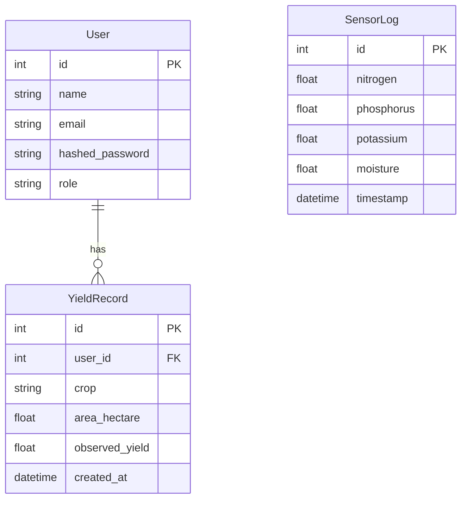

# Database Schema

This document visualizes the database relationships using Mermaid.js.

## Tables Description

### User

Stores user account information.

- **id**: Unique identifier.
- **name**: User's full name.
- **email**: User's email address (unique).
- **hashed_password**: Securely hashed password.
- **role**: User role (e.g., "farmer").

### SensorLog

Stores IoT sensor readings.

- **id**: Unique identifier.
- **nitrogen**: Soil nitrogen level.
- **phosphorus**: Soil phosphorus level.
- **potassium**: Soil potassium level.
- **moisture**: Soil moisture level.
- **timestamp**: Time of recording.

### YieldRecord

Stores crop yield data associated with users.

- **id**: Unique identifier.
- **user_id**: Foreign key linking to the User table.
- **crop**: Name of the crop.
- **area_hectare**: Area of land in hectares.
- **observed_yield**: Recorded yield amount.
- **created_at**: Time of record creation.
